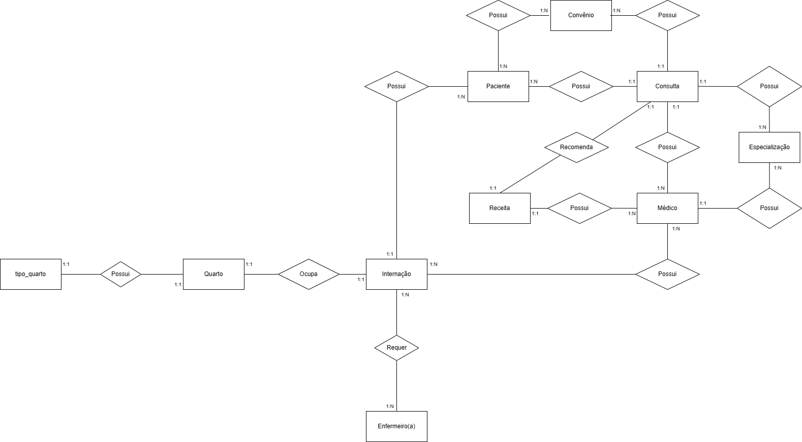

# Database Hospital

## 📖 Sobre
Um pequeno hospital local busca desenvolver um novo sistema que atenda melhor às suas necessidades. Atualmente, parte da operação ainda se apoia em planilhas e arquivos antigos, mas espera-se que esses dados sejam transferidos para o novo sistema assim que ele estiver funcional.

## 🙋 Entidades do Projeto

- Paciente;
- Médico;
- Consulta;
- Convênio;
- Receita;
- Especialização;
- Enfermeiro;
- Quarto;
- Internação;
- Quarto.

## ✏️Diagrama de Entidade Relacionamento

